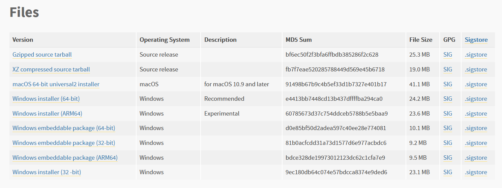

# Portable Password Manager

The project is in development right now :)

## Installation (on Windows)

Download the latest release, unzip it, and copy the files to your flash drive. Your password manager is ready to go!

Or, if you want to install everything manually (for example, for development):

1) Install a specific version of Python on your host machine
2) Download the "Windows Embeddable Package" of the same version of Python to the project folder
   From the [release page](https://www.python.org/downloads/release/python-3114/)
   or [official file cloud](https://www.python.org/ftp/python/3.11.4/):
   

3) Clone the repo with the source code:
   ```shell
   git clone https://github.com/kgleba/portable_password_manager
   ```
   
4) Assuming the folder with an embedded edition of Python is named `python-embed`:
   ```shell
   cd python-embed
   mkdir site-packages
   pip install -r ..\portable_password_manager\requirements.txt -t .\site-packages
   ```
5) Copy two created folders to your USB drive. Your password manager is ready to go!

## Firefox

<u>NB</u> Make sure that you have at least once inserted a password into your browser manually. Otherwise, soft won't be
able to retrieve and store your passwords.

If you want to reset the password for the DB, simply delete `logins.json` from a project directory and run `main.py`

Note that resetting the password for the DB will wipe out all stored entries!

It's important that you relaunch your Firefox instance after each insertion. Otherwise, Firefox won't see the changes
that were made. I'm working on that inconvenience.

## Usage

```shell
python main.py
```

... and follow the text interface instructions!

## TODO

* Create and test release with a packaged Python environment
* Include a function that updates Firefox password storage in the runtime
* Add flash drive specification for the USB ejection task 
* Check `installs.ini` and `profiles.ini` in Mozilla folder
* Implement Google Chrome support
* Implement Linux support
